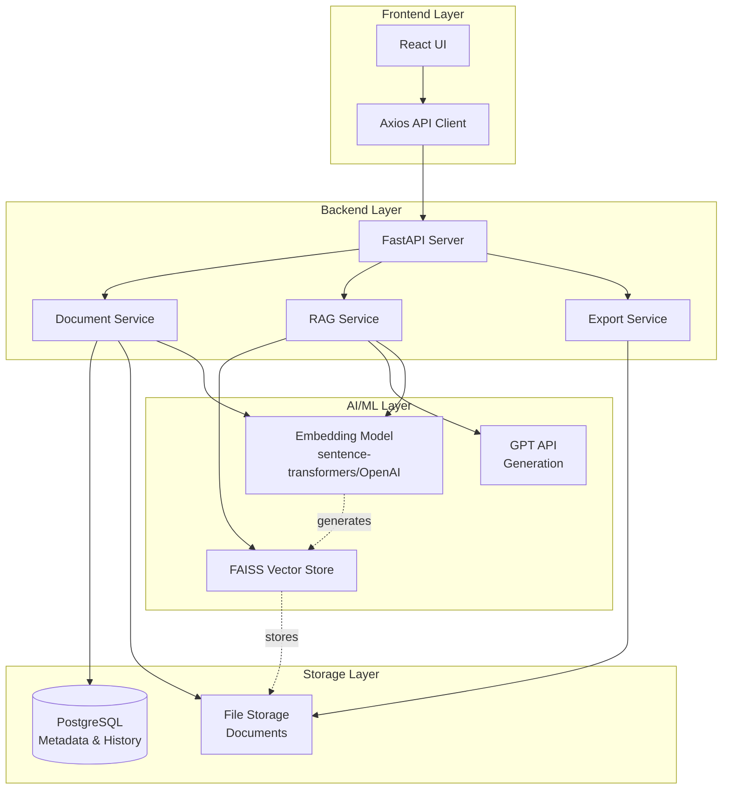
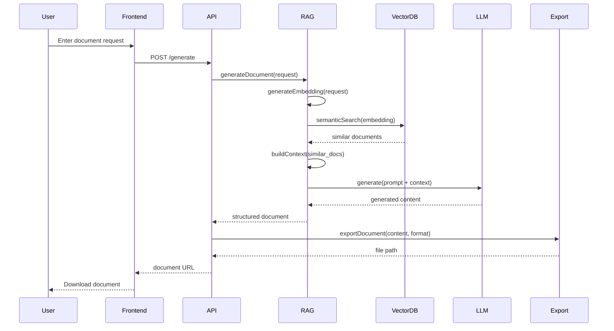

# Project Architecture: AI-Powered Document Generator with RAG

## System Overview

The AI-Powered Document Generator with RAG is an intelligent system that addresses the critical problem of inefficient document creation in professional environments. By leveraging Retrieval-Augmented Generation (RAG), the system discovers and learns from past successful documents, enabling context-aware generation of high-quality business documents.

### Key Capabilities

- **Semantic Search**: Find conceptually similar documents using vector embeddings
- **Context-Aware Generation**: Learn from past successful documents to generate relevant content
- **Multi-Format Export**: Professional PDF/DOCX output with proper formatting
- **Continuous Learning**: Improve quality through feedback and successful outcomes

### Impact Metrics

- **70% reduction** in document creation time (from 2 hours to 35 minutes)
- **Improved consistency** across organizational documents
- **Knowledge preservation** from institutional memory

---

## System Architecture



---

## Layer Breakdown

### 1. Frontend Layer
- **React UI**: User interface for document requests and management
- **Axios API Client**: HTTP client for backend communication
- **Responsibilities**:
  - Document request input
  - Document type selection
  - Preview and download generated documents
  - Feedback submission

### 2. Backend Layer
- **FastAPI Server**: Main API orchestration
- **Document Service**: Handles document ingestion, storage, and retrieval
- **RAG Service**: Core RAG pipeline implementation
- **Export Service**: Document formatting and export to PDF/DOCX
- **Responsibilities**:
  - API endpoint management
  - Business logic orchestration
  - Service coordination

### 3. AI/ML Layer
- **Embedding Model**: sentence-transformers or OpenAI embeddings
- **LLM (GPT API)**: Content generation
- **FAISS Vector Store**: Similarity search
- **Responsibilities**:
  - Generate embeddings for documents and queries
  - Semantic similarity search
  - Context-aware content generation

### 4. Storage Layer
- **PostgreSQL**: Metadata, document history, user feedback
- **File Storage**: Raw documents and generated outputs
- **Responsibilities**:
  - Persistent data storage
  - Document versioning
  - Metadata indexing

---

## Main System Flow



---

## Data Flow Pipeline

### 1. Document Ingestion Pipeline
```
Raw Document → Parse Content → Generate Embedding → Store in Vector DB → Save Metadata to PostgreSQL
```

### 2. Document Generation Pipeline
```
User Request → Generate Query Embedding → Semantic Search → Retrieve Context → Build Prompt → LLM Generation → Format Document → Export (PDF/DOCX)
```

### 3. Feedback Loop
```
User Feedback → Update Document Metadata → Adjust Retrieval Weights → Improve Future Generations
```

---

## Technology Stack

### Frontend
- **React**: UI framework
- **TypeScript**: Type-safe development
- **Axios**: HTTP client
- **Tailwind CSS**: Styling (optional)

### Backend
- **FastAPI**: Python web framework
- **Uvicorn**: ASGI server
- **Pydantic**: Data validation

### AI/ML
- **sentence-transformers**: Local embedding generation
- **OpenAI API**: Alternative embeddings + GPT for generation
- **FAISS**: Vector similarity search
- **LangChain**: RAG orchestration (optional)

### Storage
- **PostgreSQL**: Relational database
- **File System / S3**: Document storage

### Document Processing
- **PyMuPDF**: PDF reading
- **python-docx**: DOCX creation/reading
- **reportlab**: PDF generation

---

## Key Design Decisions

### 1. Why FAISS for Vector Search?
- Fast similarity search for large document collections
- Efficient memory usage
- No external service dependencies
- Easy to deploy and maintain

### 2. Why FastAPI for Backend?
- High performance (async support)
- Automatic API documentation
- Type hints and validation
- Python ecosystem compatibility

### 3. Why RAG over Fine-Tuning?
- No need to retrain models
- Easy to update knowledge base
- Transparent retrieval process
- Lower computational cost

### 4. Why PostgreSQL?
- Reliable metadata storage
- ACID compliance
- Rich query capabilities
- Future support for pgvector extension

---

## Scalability Considerations

### Horizontal Scaling
- Stateless API servers (can add more instances)
- Separate vector DB from API layer
- Load balancer for API requests

### Performance Optimization
- Cache frequently accessed embeddings
- Batch embedding generation
- Async processing for long-running tasks
- CDN for generated documents

### Storage Optimization
- Document compression
- Tiered storage (hot/cold)
- Periodic cleanup of old documents

---

## Security Considerations

- **Authentication**: JWT-based user authentication
- **Authorization**: Role-based access control
- **Data Privacy**: Encryption at rest and in transit
- **API Security**: Rate limiting, input validation
- **Secrets Management**: Environment variables for API keys
